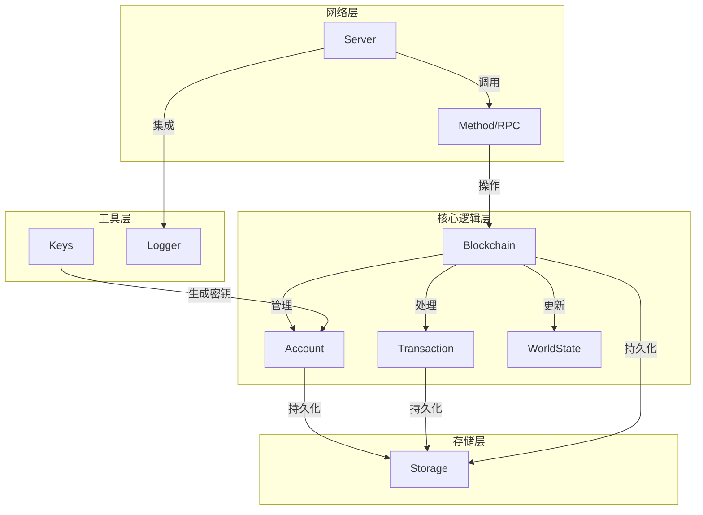

```mermaid
graph TD
    subgraph 存储层
        A[Storage]
    end

    subgraph 核心逻辑层
        B1[Account]
        B2[Blockchain]
        B3[Transaction]
        B4[WorldState]
    end

    subgraph 网络层
        C1[Server]
        C2[Method/RPC]
    end

    subgraph 工具层
        D1[Keys]
        D2[Logger]
    end

    C1 -->|调用| C2
    C2 -->|操作| B2
    B2 -->|管理| B1
    B2 -->|处理| B3
    B2 -->|更新| B4
    B1 -->|持久化| A
    B3 -->|持久化| A
    B2 -->|持久化| A
    D1 -->|生成密钥| B1
    C1 -->|集成| D2
```